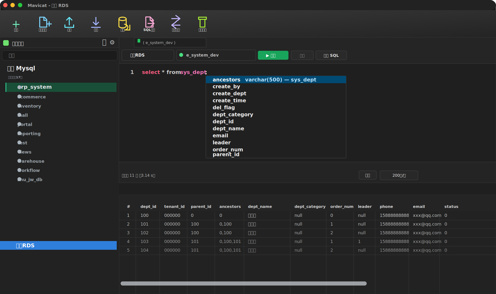

<div align="center">
  

# Mavicat

**A fast, open-source desktop database workspace for people who live in SQL.**

[Website](https://mavicat.kailingteck.com/) · [Releases](https://github.com/aitiangua876/mavicat/releases) · [Issues](https://github.com/aitiangua876/mavicat/issues) · [Contributing](./CONTRIBUTING.md)

[](https://mavicat.kailingteck.com/)
[](./LICENSE)
[](https://v2.tauri.app/)
[](https://www.rust-lang.org/)
[](https://react.dev/)
[](https://github.com/aitiangua876/mavicat/stargazers)

<p>
  <strong>README:</strong>
  <a href="./README.md">English</a> |
  <a href="./README.zh-CN.md">中文</a> |
  <a href="./README.de.md">Deutsch</a> |
  <a href="./README.es.md">Español</a> |
  <a href="./README.fr.md">Français</a> |
  <a href="./README.it.md">Italiano</a> |
  <a href="./README.ja.md">日本語</a> |
  <a href="./README.ru.md">Русский</a>
</p>
</div>



Mavicat brings professional database workflows into a modern, local-first, hackable desktop app. It is built with Tauri v2, Rust, React, and TypeScript, so it feels native, starts quickly, and keeps your database workflow close to your machine.

If you like the direction of the project, please give it a star. It helps more developers discover Mavicat and makes the open-source roadmap easier to sustain.

## Why Mavicat?

- **One workspace for daily database work**: connections, schemas, SQL tabs, data grids, table design, export, backup, sync, migration, Redis keys, and AI assistance.
- **Familiar desktop UX**: a compact connection tree, object views, tabbed editors, result panels, context menus, and wizard-style tools inspired by the workflows people already know.
- **Local-first by design**: connection profiles, query history, settings, and AI configuration live locally unless you explicitly choose otherwise.
- **No driver hunting**: common database drivers are built into the app through the Rust backend, so you do not need to install separate JDBC/ODBC/client packages for everyday use.
- **Lightweight desktop footprint**: Tauri keeps the shell compact, while Rust handles heavy database work without running a bulky server process in the background.
- **Native shell, web-speed UI**: Rust handles database work and OS integration; React powers the rich editor and data experience.
- **Open and extensible**: Apache-2.0 licensed and moving toward a practical plugin/driver ecosystem.

## Product Tour

### All-in-one Database Workspace


The main workspace keeps the connection tree, SQL editor, result grid, toolbar actions, and database context in one place. It is designed for fast switching between connections, databases, tables, query tabs, and export workflows.

| Area | What it helps with |
|---|---|
| Connection tree | Browse connections, databases, schemas, tables, columns, views, and Redis keys. |
| SQL editor | Run selected SQL or the full script, inspect multiple result sets, format SQL, and use per-tab AI help. |
| Data grid | Export current page, filtered results, or full data to CSV, JSON, Excel, and SQL. |
| Object tools | Design tables, view DDL, export dictionaries, back up databases, compare schemas, and migrate data. |
| Native runtime | No external database driver setup for common workflows; lower memory and disk overhead than heavyweight desktop stacks. |

## Supported Databases

| Database | Status |
|---|---|
| MySQL / MariaDB | Active |
| PostgreSQL | Active |
| SQLite | Active |
| SQL Server | Active |
| Redis | Active, improving key browsing and editing |
| Oracle | Planned, not included in the current milestone |

## Highlights

### Database Workspace

- Compact left connection tree with connection/database/table states.
- Database object page with table list and icon views.
- Right-click operations for connections, databases, tables, and result grids.
- Multi-tab workspace that can restore editor context across sessions.

### SQL Editor

- Monaco-powered SQL editor with formatting, execution history, selected/all execution, and multi-result output.
- Connection and database selectors per query tab.
- Ctrl-click object navigation from SQL to table data.
- Per-query AI assistant panel that can write, explain, optimize, and append SQL with human confirmation for writes.

### Data Grid

- Current-page, filtered-all, and full-data export scopes.
- Export to CSV, JSON, Excel, and SQL.
- Row selection, column visibility, pagination, copy-as-SQL, and table-data workflows.
- Work in progress: safer editing with preview, commit/rollback, undo, and better error targeting.

### Table Designer

- Field editing, primary keys, indexes, SQL preview, and table DDL inspection.
- Designed to become the long-lived schema editing surface for daily work.

### Import, Export, Backup, Migration

- Unified wizard patterns for export, import, backup, SQL file execution, schema sync, and data transfer.
- Database dictionary export in HTML, Excel, and Markdown.
- Schema comparison and SQL preview before synchronization.
- Cross-database migration with field mapping and conservative type conversion.

### Redis Workspace

- Redis connections alongside relational databases.
- Prefix-oriented key browsing is being improved toward a practical Redis desktop workflow.

## Download

Get the latest builds from:

- [Official website](https://mavicat.kailingteck.com/)
- [GitHub Releases](https://github.com/aitiangua876/mavicat/releases)
- [Download for macOS](https://github.com/aitiangua876/mavicat/releases/download/v1.0.2/Mavicat_1.0.2_macOS.dmg)
- [Download for Windows](https://github.com/aitiangua876/mavicat/releases/download/v1.0.2/Mavicat_1.0.2_Windows_Setup.exe)

Mavicat targets macOS, Windows, and Linux through the Tauri bundler. Release artifacts may vary by milestone.

## Development

Prerequisites:

- Node.js 20+
- pnpm 10+
- Rust stable
- Tauri platform prerequisites for your operating system

Run locally:

```bash
pnpm install
pnpm tauri dev
```

Build:

```bash
pnpm tauri build
```

Useful checks:

```bash
pnpm run build
pnpm test
cd src-tauri && cargo test
```

## Architecture

```text
Mavicat
├── src/             React + TypeScript frontend
├── src-tauri/       Rust backend, Tauri commands, drivers, export, migration
├── public/          Logos, fonts, static assets
├── open/            Website assets
├── tests/           Frontend tests
└── scripts/         Build and release helpers
```

Core stack:

- **Desktop**: Tauri v2
- **Backend**: Rust, SQLx, Tiberius, Redis client
- **Frontend**: React 19, TypeScript, Vite, Tailwind CSS
- **Editor**: Monaco Editor
- **Data UI**: TanStack Table / virtualization
- **Diagrams**: XYFlow

## Roadmap

- **P0 daily experience**: safer data editing, better SQL execution, stable connection states, clearer errors.
- **P1 workflows**: import/export polish, schema sync, data transfer, backup/restore progress and cancellation.
- **P2 professional tools**: table designer, ER diagrams, dictionary export, comments, indexes, foreign keys, triggers.
- **P3 product polish**: unified wizards, compact high-contrast sidebar, complete context menus, better long-task feedback.

## Contributing

Issues, bug reports, UI feedback, database-specific edge cases, translations, and pull requests are welcome. If you are not sure where to start, open an issue with your database type, operating system, and the workflow you want Mavicat to improve.

## Acknowledgements

Thanks to the open-source [Tabularis](https://github.com/TabularisDB/tabularis) project for its earlier work and inspiration.

## License

[Apache License 2.0](./LICENSE)
